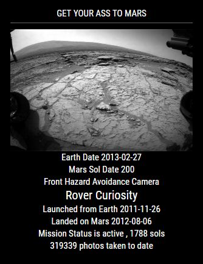
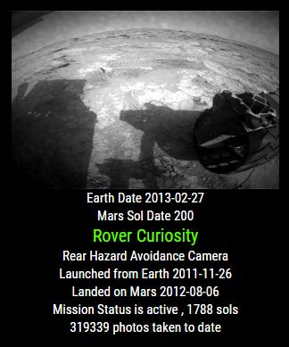

## MMM-MARS

Mars Exploration Rover missions.

## Here's what you get

* Rover's Opportunity, Spirit and Curiosity each have a full array of specialized cameras.

* Each has taken hundreds of thousands of stunning images right from the surface of Mars.

* You can choose which rover you want and the sol date that the pictures were taken.

* The module will do the rest, giving you detailed information with each image.

## Examples

* One with a header, one without a header.

 

## Installation

* `git clone https://github.com/mykle1/MMM-MARS` into the `~/MagicMirror/modules` directory.

* No API key needed if you stay within the API's call limit. (It's already set)

* Annotated .css file included for sizing and coloring, text or no text.

## Config.js entry and options

    {
        module: 'MMM-MARS',
        position: 'top_left',
        config: {
	    scroll: "no",                    // yes or no. Yes scrolls single line information under image
            rover: "curiosity",              // which rover? curiosity, opportunity or spirit
	        sol: "200",                      // sol date you want pictures from
            useHeader: false,                // true if you want a header      
            header: "",                      // useHeader must be true
            maxWidth: "300px",
            rotateInterval: 5 * 60 * 1000,   // new image 5 minutes
        }
    },

## Special thanks to NASA for fulfilling my data needs!
